# DefineX Credit Application Final Project

## [Frontend](https://github.com/AtaugurKaratas/practicum-frontend) project I made using React.js

## Used Technologies
* Monolithic Architecture
* Java 17
* Spring Boot 3.0.2
* Spring Security
* JSON Web Token
* OpenAPI
* Postgres
* Java Mail Sender
* Twilio
* Junit5 & Mockito
* Lombok
* Apache Tika
* Spring Security Role Based Authorization

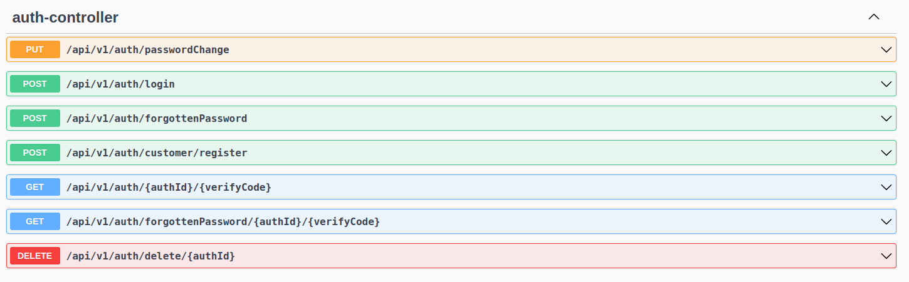

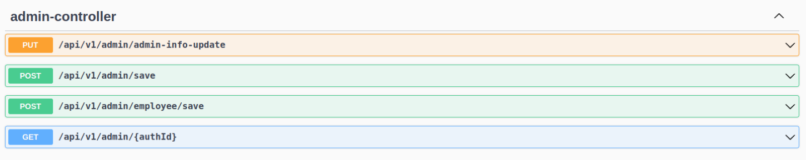

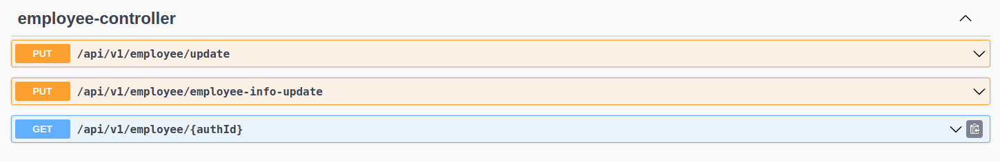

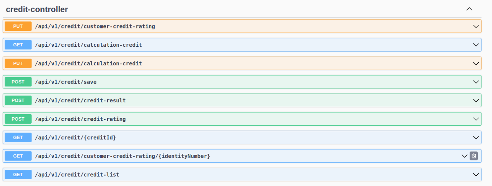

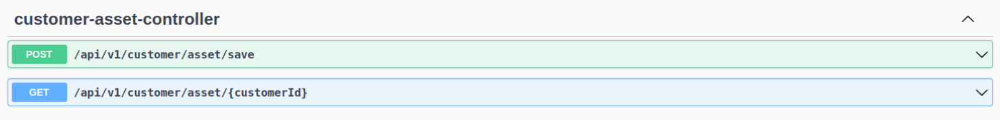

## Database

### Role Based Authorization
* ROLE_CUSTOMER
* ROLE_EMPLOYEE
* ROLE_ADMIN

## Customer

Projede Türkçe ve Ingilizce olmak üzere iki dil seçeneği vardır. Kullanıcıların navbar üzerinden yaptığı dil 
değişikliğine göre projenin arayüzü ve backend'den gelen cevaplar değişiklik gösterir. Müşteriler kayıt olurken Java'da 
bulunan annotation'lar sayesinden request record'larında belirlenen özellikleri sağlamak zorundadır. Müşteriler benzersiz
T.C. kimlik numaralarını ve email adreslerini girerek kayıt olurlar. Kayıt olduktan sonra müşteri email adresine hesabına 
giriş yapabilmesi için doğrulama linki gönderilir.

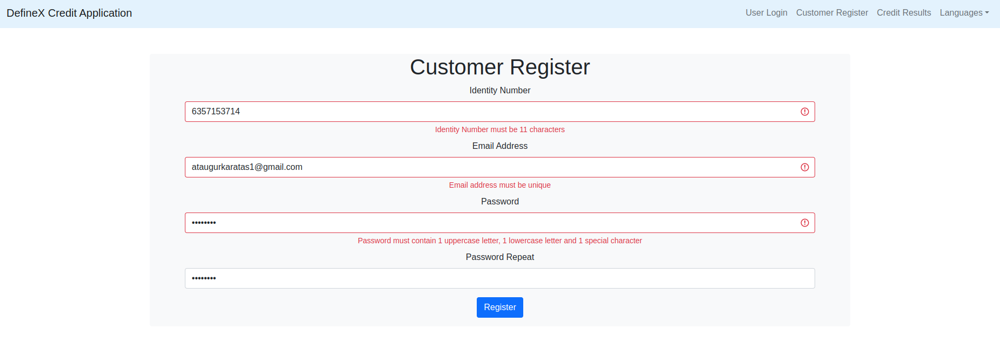

Müşteriler doğrulama linkine tıkladıkları zaman hesaplarının aktif duruma gelmesi için Spring Security içerisindeki 
UserDetails interface'inde bulunan isEnabled() method'u false durumdan true duruma geçer. Daha sonra auth tablosundaki ve
email tablosundaki bu değerler güncellenir.

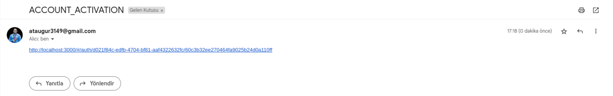

Müşteriler giriş yaptıktan sonra Müşteri bilgileri sayfasına yönlendilirler bu sayfada isim, soyisim, telefon numarası,
aylık maaş, doğum tarihi ve profil resimlerini kayıt edebilirler. Müşteriler bu sayfa üzerinde bir kere hesap bilgileri
kaydettikten sonra altta bulunan kaydet butonu güncelle butona çevrilir. Frontend'den gelen base64 formatındaki resim 
işlendikten sonra profile-images-storage dosyasına kayıt edilir. Gelen base64 formatının hangi media tipinde olduğununun
belirlenmesi için Apache Tika isimli kütüphane kullanılır. Işlemenen resim database'de bulunan customer tablosuna path
adresi olarak kayıt edilir. Müşteriler kayıt edildikten sonra customer_credit_table tablosuna müşterinin kredi skor 
bilgilerinin her bir değeri 50 olarak girilir.

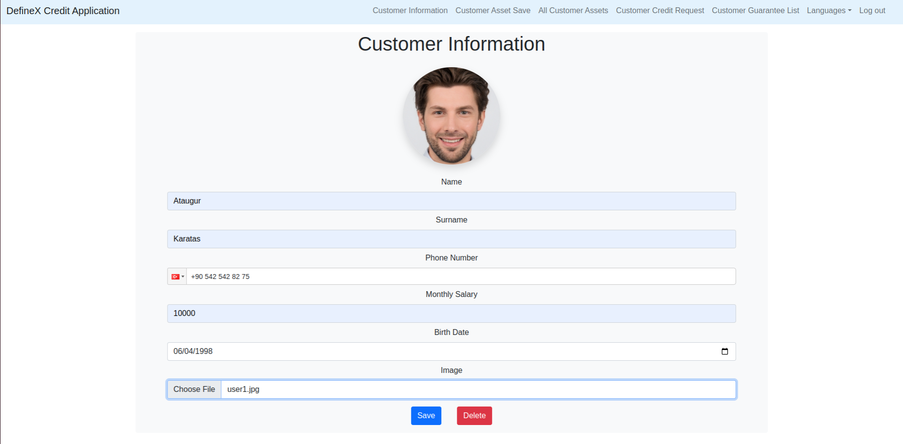

Müşterilerin teminat tiplerinden birisi de mal varlığıdır. Müşteriler mal varlığı adı, fiyatı ve resimlerini kayıt 
edebilirler. Burada kayıt edilen resimler asset-images-storage klasöründe saklanır.

Müşteriler kayıt ettikleri mal varlıklarının tümünü resim, isim ve fiyatları ile birlikte görüntüleyebilirler.

Müşteriler kredi başvurusu yaparken T.C. kimlik numaralarını ve doğum tarihlerini girerek kredi başvurusunda 
bulunabilirler. Müşterilerin teminatları bulunduğu durumda teminat tipini seçerek ona göre işlem yapabilirler. 
Müşteriler başka bir müşteriyi teminat gösterdikleri durumda o müşteriye ait T.C. kimlik numarası ve teminat değeri 
olarak gösterilecek değeri girebilirler. Mal varlıklarını teminat olarak göstermek isterlerse selected içerisinde bulunan 
kendi mal varlıklarından birisini seçebilirler. Seçim yaptıklarında Teminat tutarına otomatik olarak mal varlığının 
değeri yazdırılacaktır.

## Credit

Teminat isteği yapılan müşteri gelen liste aracılığı ile istek yapan kişinin resmini, ad ve soyadını, teminat olarak
gösterilen tutarı ve onay durumunu görüntüleyebilir. Detay butonuna tıklayarak teminatın detay sayfasına gider ve 
onaylama ve reddetme işlemlerinden birisine yapabilir. Eğer bir kredi de teminat olarak başka bir müşteri gösterildiyse 
o müşteri onaylamadan çalışanlar bu kredi bilgilerini göremezler. Direkt ret edilmesi durumunda ise kredi başvurusu
otomatik olarak ret edilir.

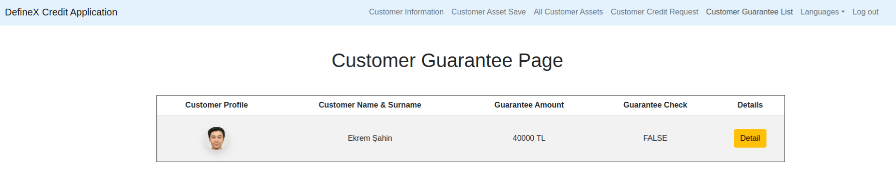

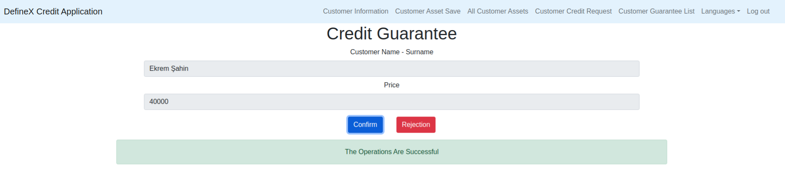

## Admin

Admin projeye yeni çalışanlar veya adminler ekleyebilir. Kaydetme işlemini yaptıktan sonra otomatik olarak kayıt edilen
kişinin email adresine hesabının parolası gönderilir.

Kredi skorlarının hesaplanma mantığının sadece admin kullanıcıları düzenleyebilir. Mevcut kredi borç durumu, kredi ödeme
düzeni, kredi kullanım yoğunluğu, yeni alınan kredi ve kredi başlangıç skoruna göre kredi değerleri hesaplanabilir.
Kredi başlangıç skoru hariç diğer değerler yüzdeler üzerinden pay edilir. Yüzde yüz olmadığı durumlarda kayıt etme 
işlemi yapılmaz. Repository'de bulunan query aracılığı ile son kayıt edilen değerler kredi hesaplamarında kullanılır.
Kredi başlangıç skoru hariç diğer tüm değerlerin kredi hesaplama işlemine verdiği katkı maksimum 1000'dir. Kredi
başlangıç skoru ise bu değerin üzerine eklenebilir. Örnek vermek gerekirse kredi başlangıç skoru 250 ise bu sistemde
müşterilerin kredi skorları minimum 250, maksimum ise 1250 olabilir.

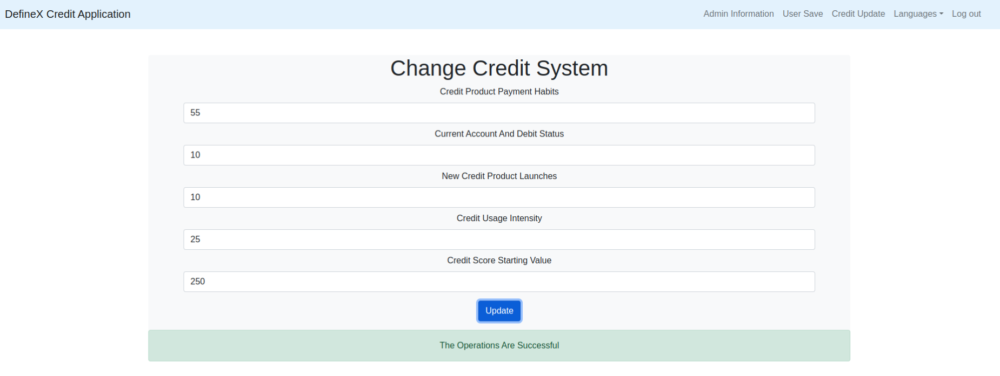

## Employee

Çalışanlar kullanıcıların kredi skorlarının her bir değerini yüzdeler üzerinden düzenleyebilir. Değerler admin tarafından
belirlenen kredi sistemindeki yüzdelere göre kredi skoruna etki eder. Örnek vermek gerekirse mevcut kredi borç durumunun
etki yüzdesi admin tarafında %50 olarak belirlendi ise bu durumda kredi skoruna maksimum 500 puanlık bir katkı 
sağlayacaktır ve müşterinin kredi borç durumu %80 ise bu durum kredi skoruna 400 puan gibi bir katkı sağlar.

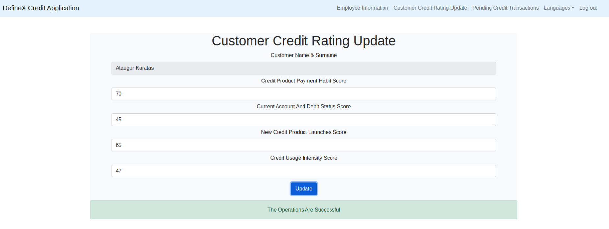

Çalışanlar kredi başvurularını liste halinde görüntüleyebilirler. Müşterilerin resimlerini, ad ve soyadlarını, aylık 
gelir bilgilerini, eğer teminatları varsa teminat türlerini, belirlenen teminat tutarını görüntüleyebilirler. Detay
butonuna tıklandığı durumda kredi detay sayfasına yönlendirilirler.

Çalışan sonuçlandır butonuna tıkladığı zaman kredi skoru hesaplanır ve database'e kayıt edilir, sonrasında ise kullanıcıya
kredi başvurusu başarılı olduysa onay bilgisi ve kredi limit tutarı gönderilir. Eğer başvuru işlemi başarısız olduysa 
sadece ret mesajı gönderilir.

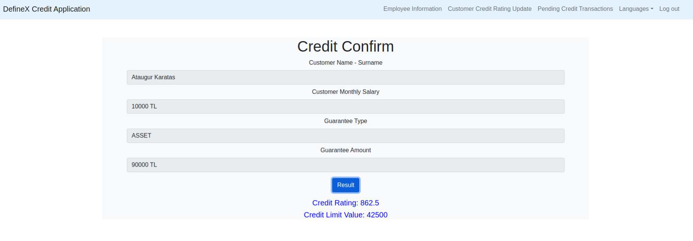

## Credit Results

Kullanıcılar login işlemi yapmadan kredi sonuçlarını görüntüleyebilirler. T.C. kimlik numaraları eşleştiği taktirde
kullanıcıların son kredi başvurusu işlemlerinin sonuçları gösterilir. Üç durum üzerinden bu işlem gerçekleşir. Kredi
başvurusu beklemekte, onaylandı ve reddedildi.

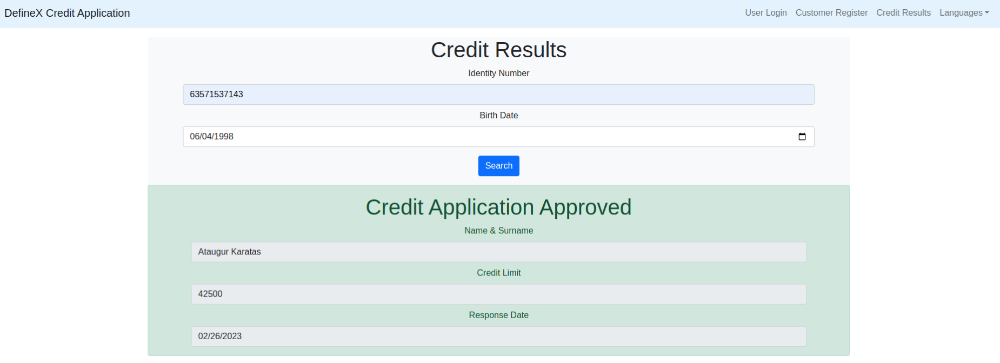

## Sms

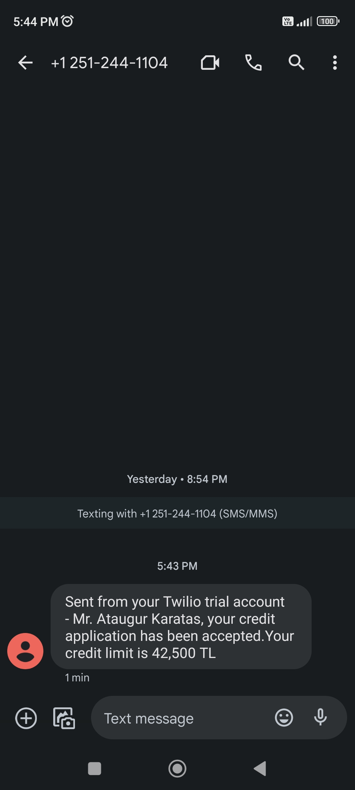